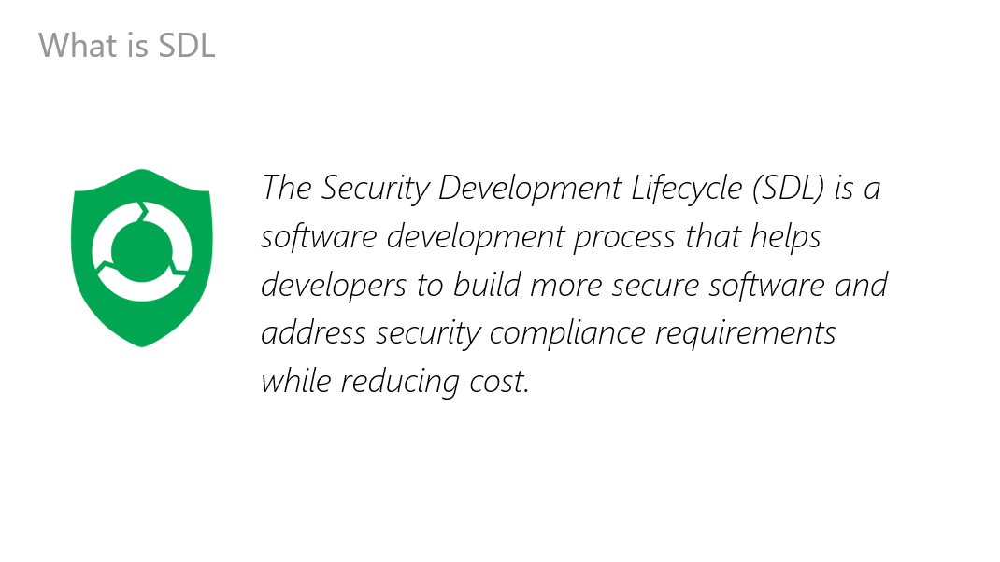
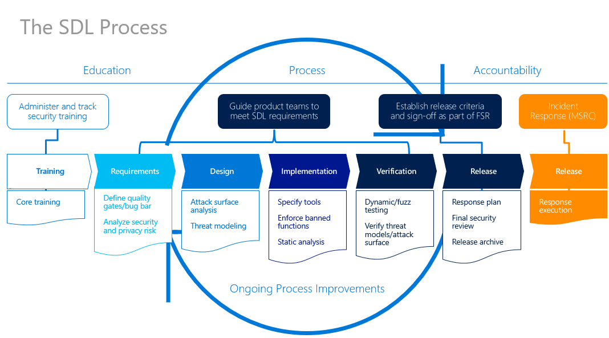

# Microsoft Secure Development Lifecycle

The Security Development Lifecycle (SDL) is a security assurance process that is focused on software development. As a company-wide initiative and a mandatory policy since 2004, the SDL has played a critical role in embedding security and privacy in software and culture at Microsoft. Combining a holistic and practical approach, the SDL aims to reduce the number and severity of vulnerabilities in software. The SDL introduces security and privacy throughout all phases of the development process. 

The Microsoft SDL is based on three core concepts—education, continuous process improvement, and accountability. The ongoing education and training of technical job roles within a software development group is critical. The appropriate investment in knowledge transfer helps organizations to react appropriately to changes in technology and the threat landscape. Because security risk is not static, the SDL places heavy emphasis on understanding the cause and effect of security vulnerabilities and requires regular evaluation 

## Table Of Content

[TOC]

####  Why & What SDL  [Link](SDLBasic\SDL.md) 

#### Training [Link]()

#### ThreatModeling's Tool [Link](ThreatModeling\Tools.md) 

#### Implementation's Tool  [Link](ToolBox\Toolbox.md)  

 

